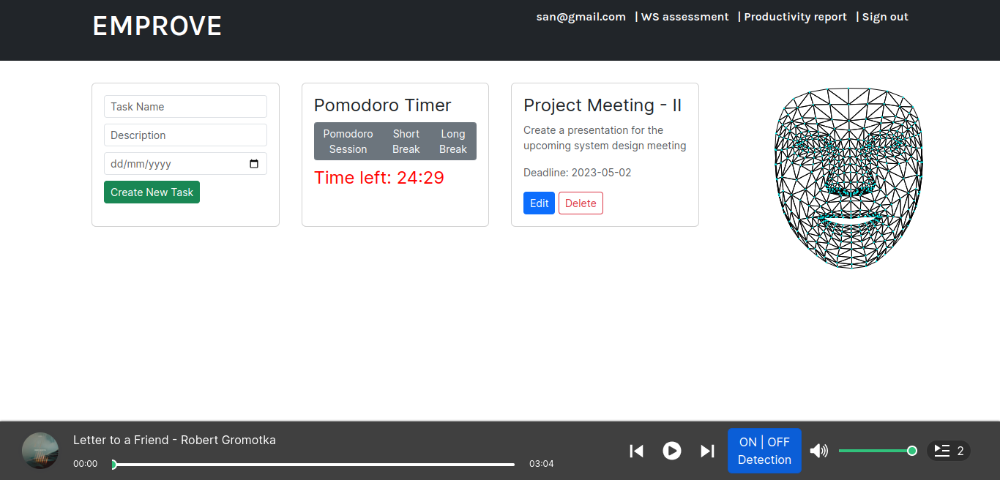

# EMPROVE - An Employee Productivity System using ML

[](https://forthebadge.com)

EMPROVE is a comprehensive web-based productivity system designed to enhance productivity, task management and overall work efficiency of employees at their workplace. The system provides a range of features and tools that assist employees in organizing their workload, managing time effectively and maximizing productivity. It aims to create a positive work environment that promotes focus, reduces stress and improves job satisfaction.



## Features
1. **Task Management**: Organize tasks into manageable units, set priorities and track progress.
2. **Pomodoro Timer**: Implement the Pomodoro technique, a time-management method that utilizes focused work intervals followed by short breaks.
3. **Concentration Music**: Select from a collection of soothing instrumental tracks to enhance focus and create an optimal work environment.
4. **Drowsiness Detection**: Real-time monitoring of facial features to detect signs of drowsiness and provide alerts for improved alertness and focus.
5. **Work Stress Assessment**: Evaluate stress levels and identify stress patterns to enable effective stress management and increased resilience.
6. **Productivity Reports**: Detailed reports that offer insights into performance, time management and areas for improvement.

## Dependencies
- **@babel/core**: ^7.20.12
- **@babel/preset-react**: ^7.18.6
- **@mediapipe/face_mesh**: ^0.4.1633559619
- **@tensorflow-models/face-landmarks-detection**: ^1.0.2
- **@tensorflow/tfjs**: ^4.2.0
- **@tensorflow/tfjs-backend-webgl**: ^4.2.0
- **axios**: ^1.3.3
- **babel-loader**: ^9.1.2
- **body-parser**: ^1.20.1
- **cors**: ^2.8.5
- **css-loader**: ^6.7.3
- **ejs**: ^3.1.8
- **express**: ^4.18.2
- **md5**: ^2.3.0
- **mongodb**: ^5.0.1
- **mongoose**: ^6.9.1
- **nodemon** : ^2.0.20
- **npm-run-all**: ^4.1.5
- **react**: ^18.2.0
- **react-dom**: ^18.2.0
- **react-jinke-music-player**: ^4.24.2
- **react-webcam**: ^7.0.1
- **style-loader**: ^3.3.1
- **webpack**: ^5.75.0
- **webpack-cli**: ^5.0.1
- **webpack-node-externals**: ^3.0.0

## Installation
To install and run EMPROVE locally, follow these steps:

1. Clone the repository:
   ```
   git clone https://github.com/sanbabyfrancis/emprove.git
   ```

2. Install the required dependencies:
   ```
   npm install
   ```

3. Run the MongoDB server:
   ```
   mongod
   ```

4. Start the application:
   ```
   npm run dev
   ```

5. Access EMPROVE in your browser:
   ```
   http://localhost:3000
   ```

## Usage
1. Sign up for an account with EMPROVE using your email address.
2. Log in to your account and explore the various features available.
3. Set up your tasks and organize them based on priority and deadlines.
4. Utilize the Pomodoro timer to work in focused intervals and take regular breaks.
5. Choose concentration music to create an optimal work environment.
6. Benefit from drowsiness detection to maintain alertness during working hours.
7. Assess your work stress levels and take necessary steps for effective stress management.
8. Review productivity reports to gain insights into your performance, time management and areas for improvement.

## Contact

**San Baby Francis** <br>
san.baby.francis123@gmail.com

[![LinkedIn][linkedin-shield]][linkedin-url]
[](https://twitter.com/sanbabyfrancis)

[linkedin-shield]: https://img.shields.io/badge/-LinkedIn-black.svg?style=for-the-badge&logo=linkedin&colorB=555
[linkedin-url]: https://linkedin.com/in/sanbabyfrancis
